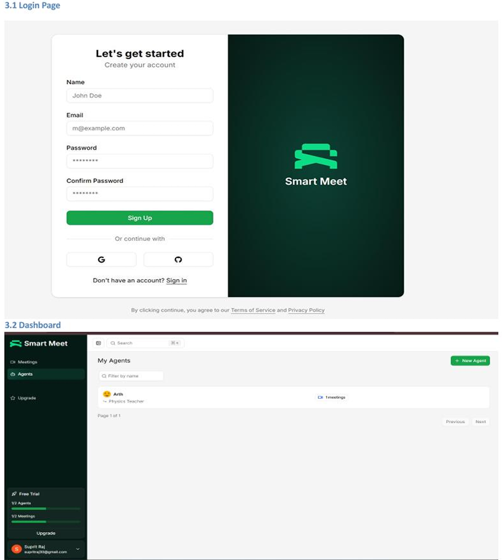
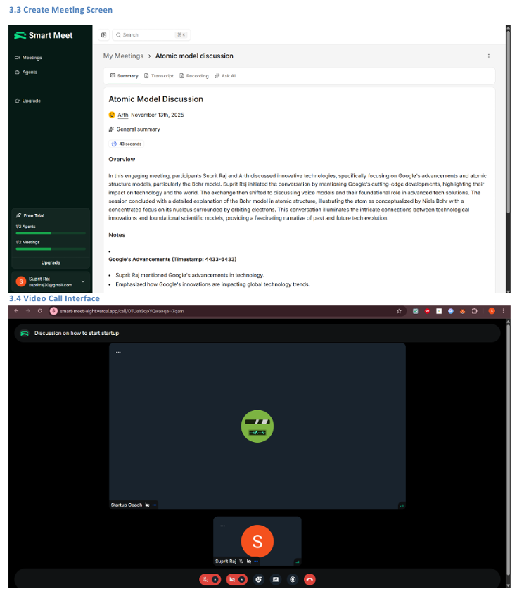

# Smart Meet 🎥

**Meet smarter, capture insights.**

Smart Meet is an AI-powered meeting platform that records, transcribes, and summarizes your meetings in real-time. Leverage intelligent AI agents to triage action items, generate highlights, and extract meaningful insights from every conversation.




---

## ✨ Features

- **📹 Video Meetings** - High-quality video calls with recording capabilities
- **🎙️ Real-time Transcription** - Accurate, searchable transcripts for every meeting
- **🤖 AI Agents** - Automated note-taking, action item extraction, and intelligent summaries
- **💬 Chat & Collaboration** - In-meeting chat with context-aware messaging
- **📊 Analytics & Insights** - Track meeting metrics and team productivity
- **🔒 Secure & Private** - End-to-end encryption and enterprise-grade security
- **🎨 Beautiful UI** - Modern, responsive interface built with Next.js 15 and Tailwind CSS

---

## 🚀 Tech Stack

### Core
- **[Next.js 15](https://nextjs.org/)** - React framework with App Router
- **[TypeScript](https://www.typescriptlang.org/)** - Type-safe development
- **[Tailwind CSS](https://tailwindcss.com/)** - Utility-first styling
- **[Drizzle ORM](https://orm.drizzle.team/)** - Type-safe database toolkit
- **[Neon Database](https://neon.tech/)** - Serverless Postgres

### Video & Communication
- **[Stream Video SDK](https://getstream.io/video/)** - Real-time video infrastructure
- **[Stream Chat](https://getstream.io/chat/)** - In-app chat functionality
- **[OpenAI Realtime API](https://platform.openai.com/)** - Real-time AI transcription

### State & Data Management
- **[tRPC](https://trpc.io/)** - End-to-end typesafe APIs
- **[TanStack Query](https://tanstack.com/query)** - Powerful data synchronization
- **[Zod](https://zod.dev/)** - TypeScript-first schema validation

### Authentication & Payments
- **[Better Auth](https://www.better-auth.com/)** - Modern authentication solution
- **[Polar](https://polar.sh/)** - Subscription and billing management

### AI & Automation
- **[OpenAI](https://openai.com/)** - GPT models for summarization and insights
- **[Inngest](https://www.inngest.com/)** - Durable workflow orchestration

### UI Components
- **[Radix UI](https://www.radix-ui.com/)** - Unstyled, accessible components
- **[Lucide Icons](https://lucide.dev/)** - Beautiful icon library
- **[shadcn/ui](https://ui.shadcn.com/)** - Re-usable component patterns

---

## 📋 Prerequisites

Before you begin, ensure you have the following installed:

- **Node.js** (v20 or higher)
- **npm** or **yarn** or **pnpm**
- **PostgreSQL database** (or use Neon for serverless Postgres)

You'll also need API keys for:
- Stream (Video & Chat)
- OpenAI
- Polar (for payments)
- Inngest (for workflows)

---

## 🛠️ Getting Started

### 1. Clone the repository

```bash
git clone https://github.com/supritR21/Smart-Meet.git
cd Smart-Meet
```

### 2. Install dependencies

```bash
npm install
```

### 3. Set up environment variables

Create a `.env` file in the root directory:

```env
# Database
DATABASE_URL="your_neon_postgres_url"

# Better Auth
BETTER_AUTH_SECRET="your_secret_key"
BETTER_AUTH_URL="http://localhost:3000"

# Stream
STREAM_API_KEY="your_stream_api_key"
STREAM_API_SECRET="your_stream_api_secret"

# OpenAI
OPENAI_API_KEY="your_openai_api_key"

# Polar (Payments)
POLAR_ACCESS_TOKEN="your_polar_access_token"

# Inngest
INNGEST_EVENT_KEY="your_inngest_event_key"
INNGEST_SIGNING_KEY="your_inngest_signing_key"

# OAuth Providers (optional)
GITHUB_CLIENT_ID="your_github_client_id"
GITHUB_CLIENT_SECRET="your_github_client_secret"
GOOGLE_CLIENT_ID="your_google_client_id"
GOOGLE_CLIENT_SECRET="your_google_client_secret"
```

### 4. Set up the database

Push the database schema:

```bash
npm run db:push
```

Open Drizzle Studio to inspect your database (optional):

```bash
npm run db:studio
```

### 5. Run the development server

```bash
npm run dev
```

Open [http://localhost:3000](http://localhost:3000) in your browser.

---

## 📜 Available Scripts

| Command | Description |
|---------|-------------|
| `npm run dev` | Start the development server |
| `npm run build` | Build the production application |
| `npm start` | Start the production server |
| `npm run lint` | Run ESLint to check code quality |
| `npm run db:push` | Push database schema changes |
| `npm run db:studio` | Open Drizzle Studio (database GUI) |
| `npm run dev:webhook` | Expose local server via ngrok for webhooks |

---

## 📁 Project Structure

```
Smart-Meet/
├── src/
│   ├── app/                 # Next.js App Router pages
│   │   ├── (auth)/          # Authentication pages
│   │   ├── (dashboard)/     # Dashboard pages
│   │   ├── call/            # Video call pages
│   │   └── api/             # API routes (tRPC, webhooks)
│   ├── components/          # Reusable UI components
│   │   └── ui/              # shadcn/ui components
│   ├── db/                  # Database schema and configuration
│   ├── hooks/               # Custom React hooks
│   ├── inngest/             # Inngest workflow functions
│   ├── lib/                 # Utility functions and configurations
│   ├── modules/             # Feature modules
│   │   ├── agents/          # AI agents feature
│   │   ├── auth/            # Authentication
│   │   ├── call/            # Video calling
│   │   ├── dashboard/       # Dashboard views
│   │   ├── home/            # Landing page
│   │   ├── meetings/        # Meetings management
│   │   └── premium/         # Subscription/billing
│   └── trpc/                # tRPC router and configuration
├── public/                  # Static assets
├── .env                     # Environment variables (not committed)
├── drizzle.config.ts        # Drizzle ORM configuration
├── next.config.ts           # Next.js configuration
├── tailwind.config.ts       # Tailwind CSS configuration
└── tsconfig.json            # TypeScript configuration
```

---

## 🎯 Key Features Explained

### AI Agents
Create custom AI agents that can:
- Automatically generate meeting summaries
- Extract action items and decisions
- Answer questions about meeting content
- Track follow-ups and deadlines

### Meeting Management
- Schedule and manage meetings
- Invite participants via email
- View meeting history and recordings
- Search transcripts for specific topics

### Real-time Collaboration
- HD video and audio
- Screen sharing
- In-meeting chat
- Real-time transcription
- Participant controls

### Subscription Plans
- Free tier with limited features
- Premium plans with unlimited meetings and agents
- Managed through Polar billing system

---

## 🔐 Security

- All video streams are encrypted in transit
- End-to-end encryption for sensitive data
- Secure authentication with Better Auth
- Environment variables for sensitive credentials
- Regular security audits and updates

---

## 🤝 Contributing

Contributions are welcome! Please follow these steps:

1. Fork the repository
2. Create a feature branch (`git checkout -b feature/amazing-feature`)
3. Commit your changes (`git commit -m 'Add amazing feature'`)
4. Push to the branch (`git push origin feature/amazing-feature`)
5. Open a Pull Request

---

## 📝 License

This project is private and proprietary. All rights reserved.

---

## 👥 Support

For support, email supritraj30@gmail.com or open an issue in the GitHub repository.

---

## 🙏 Acknowledgments

- [Next.js](https://nextjs.org/) for the amazing framework
- [Stream](https://getstream.io/) for video infrastructure
- [OpenAI](https://openai.com/) for AI capabilities
- [Vercel](https://vercel.com/) for hosting and deployment
- All open-source contributors and maintainers

---

**Built with ❤️ by the Smart Meet team**


